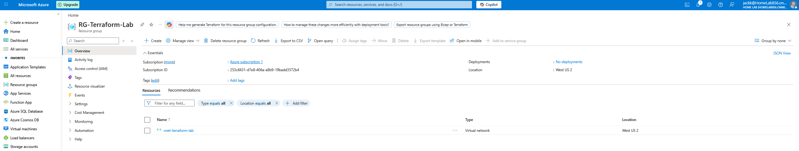
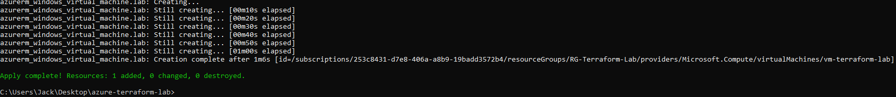
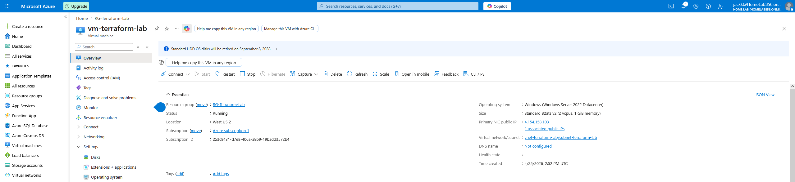
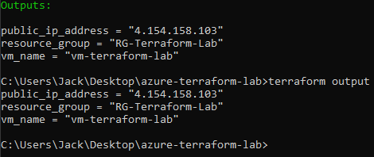
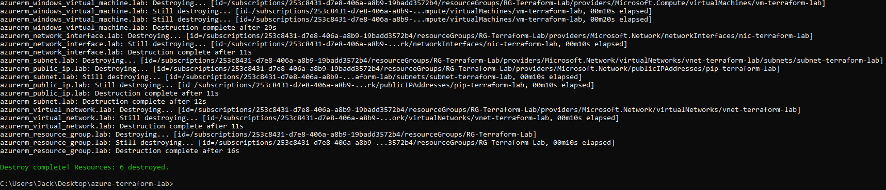

# Azure Infrastructure with Terraform

A hands-on lab demonstrating Infrastructure as Code (IaC) using Terraform to provision and manage Azure resources. This project covers the full Terraform workflow: writing configuration, initializing providers, planning, applying, and destroying infrastructure.

---

## Objectives

- Install and configure Terraform with the Azure provider
- Authenticate to Azure using the Azure CLI
- Write Terraform configuration to provision a complete Azure environment
- Use outputs to surface key resource values
- Demonstrate the full IaC lifecycle including teardown with `terraform destroy`

---

## Tools & Technologies

- Terraform v1.14.9
- Azure CLI
- AzureRM Terraform Provider v3.117.1
- Microsoft Azure (West US 2)

---

## Infrastructure Provisioned

| Resource | Name | Details |
|---|---|---|
| Resource Group | RG-Terraform-Lab | West US 2 |
| Virtual Network | vnet-terraform-lab | 10.0.0.0/16 |
| Subnet | subnet-terraform-lab | 10.0.1.0/24 |
| Public IP | pip-terraform-lab | Standard SKU, Static |
| Network Interface | nic-terraform-lab | Dynamic private IP |
| Windows VM | vm-terraform-lab | Windows Server 2022, Standard_B2ats_v2 |

---

## File Structure

```
azure-terraform-lab/
├── main.tf        # All resource definitions
├── outputs.tf     # Output values (public IP, VM name, resource group)
└── .terraform/    # Provider plugins (auto-generated by terraform init)
```

---

## Lab Walkthrough

### 1. Provider Configuration and Initialization

Configured the AzureRM provider in `main.tf` and authenticated using the Azure CLI via `az login`. Running `terraform init` downloaded the provider plugins and initialized the working directory.

```hcl
terraform {
  required_providers {
    azurerm = {
      source  = "hashicorp/azurerm"
      version = "~> 3.0"
    }
  }
}

provider "azurerm" {
  features {}
  skip_provider_registration = true
}
```

---

### 2. Network Infrastructure

Defined a resource group, virtual network, and subnet. Resources reference each other using Terraform's interpolation syntax, for example the VNet references the resource group's location and name directly rather than hardcoding values.

```hcl
resource "azurerm_resource_group" "lab" {
  name     = "RG-Terraform-Lab"
  location = "West US 2"
}

resource "azurerm_virtual_network" "lab" {
  name                = "vnet-terraform-lab"
  address_space       = ["10.0.0.0/16"]
  location            = azurerm_resource_group.lab.location
  resource_group_name = azurerm_resource_group.lab.name
}

resource "azurerm_subnet" "lab" {
  name                 = "subnet-terraform-lab"
  resource_group_name  = azurerm_resource_group.lab.name
  virtual_network_name = azurerm_virtual_network.lab.name
  address_prefixes     = ["10.0.1.0/24"]
}
```

[](screenshots/02-resource-group-portal.png)

---

### 3. Virtual Machine

Added a public IP, network interface, and Windows Server 2022 VM. The VM references the NIC, which references the subnet, creating an implicit dependency chain that Terraform resolves automatically.

The admin password is passed via an input variable rather than hardcoded. The variable is defined in `variables.tf` and marked as `sensitive = true` so it is never printed in plan or apply output. The actual value is supplied at runtime via a `.tfvars` file which is excluded from version control via `.gitignore`.

```hcl
resource "azurerm_public_ip" "lab" {
  name                = "pip-terraform-lab"
  location            = azurerm_resource_group.lab.location
  resource_group_name = azurerm_resource_group.lab.name
  allocation_method   = "Static"
  sku                 = "Standard"
}

resource "azurerm_network_interface" "lab" {
  name                = "nic-terraform-lab"
  location            = azurerm_resource_group.lab.location
  resource_group_name = azurerm_resource_group.lab.name

  ip_configuration {
    name                          = "internal"
    subnet_id                     = azurerm_subnet.lab.id
    private_ip_address_allocation = "Dynamic"
    public_ip_address_id          = azurerm_public_ip.lab.id
  }
}

resource "azurerm_windows_virtual_machine" "lab" {
  name                = "vm-terraform-lab"
  computer_name       = "vm-tf-lab"
  resource_group_name = azurerm_resource_group.lab.name
  location            = azurerm_resource_group.lab.location
  size                = "Standard_B2ats_v2"
  admin_username      = "labadmin"
  admin_password      = var.admin_password

  network_interface_ids = [azurerm_network_interface.lab.id]

  os_disk {
    caching              = "ReadWrite"
    storage_account_type = "Standard_LRS"
  }

  source_image_reference {
    publisher = "MicrosoftWindowsServer"
    offer     = "WindowsServer"
    sku       = "2022-Datacenter"
    version   = "latest"
  }
}
```

`variables.tf`:

```hcl
variable "admin_password" {
  description = "Admin password for the VM"
  type        = string
  sensitive   = true
}
```
```

[](screenshots/03-terraform-vm-apply.png)

[](screenshots/04-vm-portal.png)

---

### 4. Outputs

Defined outputs in `outputs.tf` to surface the public IP address, VM name, and resource group after apply. Outputs are useful for passing values to other configurations or scripts.

```hcl
output "public_ip_address" {
  value = azurerm_public_ip.lab.ip_address
}

output "vm_name" {
  value = azurerm_windows_virtual_machine.lab.name
}

output "resource_group" {
  value = azurerm_resource_group.lab.name
}
```

[](screenshots/05-terraform-outputs.png)

---

### 5. Destroy

Ran `terraform destroy` to tear down all 6 resources cleanly. This demonstrates a key advantage of IaC: infrastructure can be fully reprovisioned or decommissioned with a single command.

[](screenshots/06-terraform-destroy.png)

---

## Key Takeaways

- Terraform maintains a state file (`terraform.tfstate`) that tracks deployed resources; this is how it knows what to update or destroy on subsequent runs
- Resources reference each other via interpolation (`azurerm_resource_group.lab.name`) rather than hardcoded strings, making configs portable and maintainable
- `skip_provider_registration = true` is necessary when the account lacks permissions to register Azure resource providers at the subscription level
- Windows VM names in Azure are limited to 15 characters; the `computer_name` argument overrides the default which is derived from the resource `name`
- Standard SKU public IPs require `allocation_method = "Static"`; Basic SKU has per-subscription limits that may be exhausted on free trial accounts
